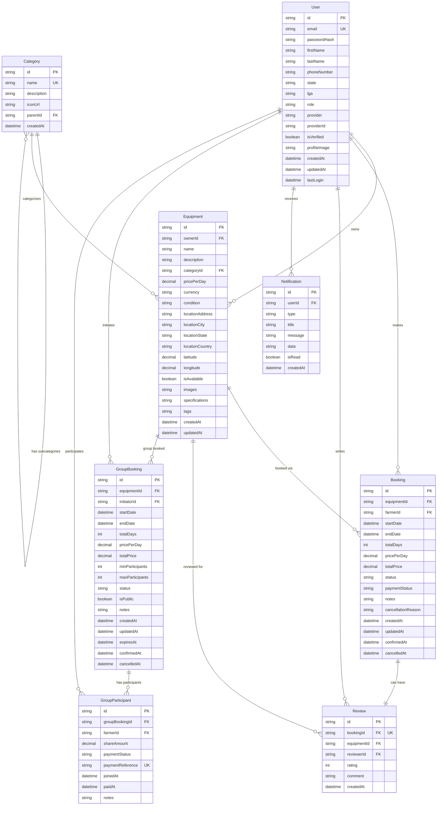
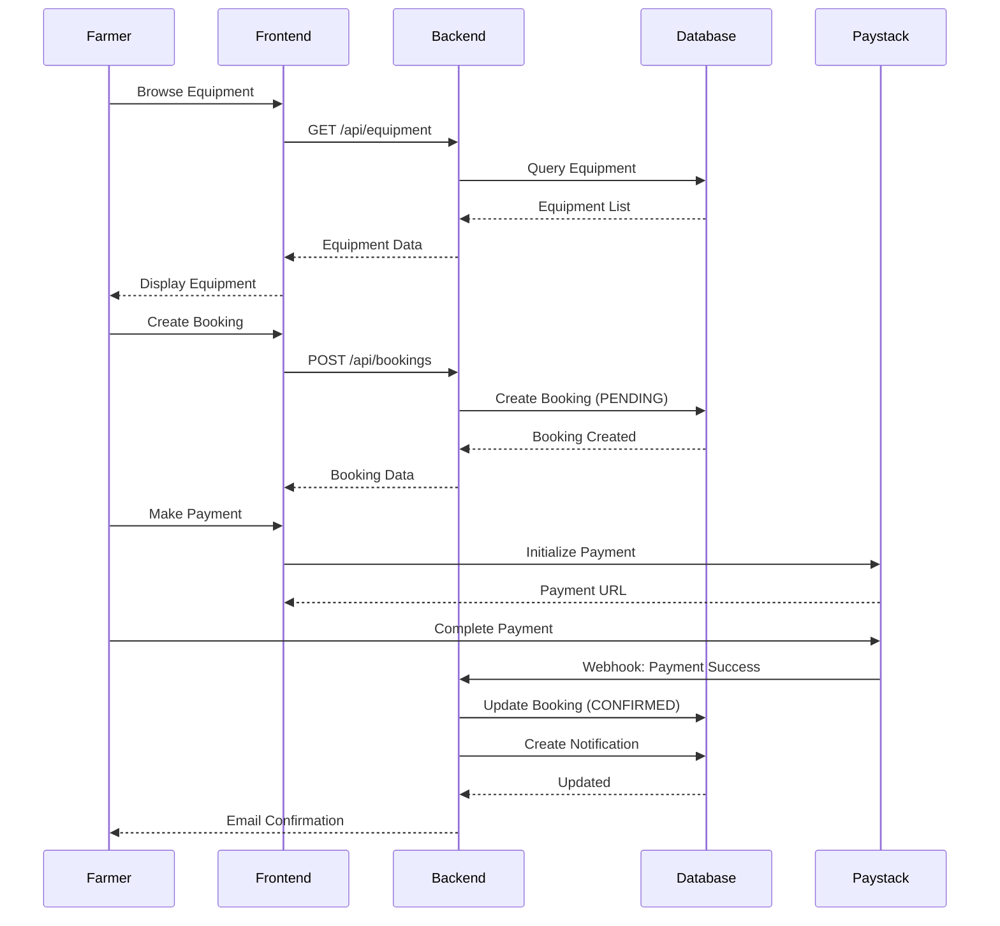
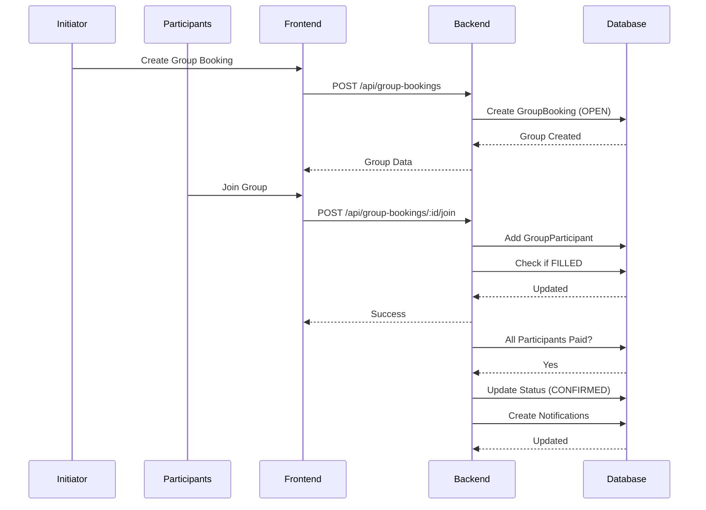

# Farm Equipment Management System (FEMS) - Data Model

## Table of Contents
1. [Overview](#overview)
2. [Entity Relationship Diagram](#entity-relationship-diagram)
3. [Database Entities](#database-entities)
4. [Service Models](#service-models)
5. [UI Data Types](#ui-data-types)
6. [Enums & Constants](#enums--constants)
7. [API Response Patterns](#api-response-patterns)

---

## Overview

The Farm Equipment Management System (FEMS) is a platform that connects farmers with farm equipment owners in Nigeria's Southwest region. The system supports:
- Individual equipment bookings
- Group booking functionality (cost-sharing)
- Equipment listing and management
- Review and rating system
- Payment integration (Paystack)
- Role-based access control (FARMER, PLATFORM_OWNER, ADMIN)

**Technology Stack:**
- Database: Microsoft SQL Server
- ORM: Prisma
- Backend: Node.js + Express + TypeScript
- Frontend: Next.js 15 + React 19 + TypeScript

---

## Entity Relationship Diagram

### Core System ERD



### Relationship Summary

| Parent Entity | Relationship Type | Child Entity | Description |
|---------------|------------------|--------------|-------------|
| User | One-to-Many | Equipment | A user can own multiple equipment items |
| User | One-to-Many | Booking | A farmer can make multiple bookings |
| User | One-to-Many | Review | A user can write multiple reviews |
| User | One-to-Many | Notification | A user can receive multiple notifications |
| User | One-to-Many | GroupBooking | A user can initiate multiple group bookings |
| User | One-to-Many | GroupParticipant | A user can participate in multiple group bookings |
| Category | One-to-Many | Category | Categories can have subcategories (self-referential) |
| Category | One-to-Many | Equipment | A category contains multiple equipment items |
| Equipment | One-to-Many | Booking | Equipment can be booked multiple times |
| Equipment | One-to-Many | Review | Equipment can have multiple reviews |
| Equipment | One-to-Many | GroupBooking | Equipment can have multiple group bookings |
| Booking | One-to-One | Review | A booking can have one review (optional) |
| GroupBooking | One-to-Many | GroupParticipant | A group booking has multiple participants |

---

## Database Entities

### 1. User
Represents all users in the system (farmers, equipment owners, admins).

**Fields:**
- `id` (UUID, PK): Unique identifier
- `email` (String, Unique): User's email address
- `passwordHash` (String, Nullable): Hashed password (null for OAuth users)
- `firstName` (String, Nullable): User's first name
- `lastName` (String, Nullable): User's last name
- `phoneNumber` (String, Nullable): Contact number
- `state` (String, Nullable): Nigerian state
- `lga` (String, Nullable): Local Government Area
- `role` (String): FARMER | PLATFORM_OWNER | ADMIN
- `provider` (String): LOCAL | GOOGLE | FACEBOOK | MICROSOFT
- `providerId` (String, Nullable): OAuth provider ID
- `isVerified` (Boolean): Email verification status
- `profileImage` (String, Nullable): Profile picture URL
- `createdAt` (DateTime): Account creation timestamp
- `updatedAt` (DateTime): Last update timestamp
- `lastLogin` (DateTime, Nullable): Last login timestamp

**Indexes:**
- `email` (for login queries)
- `role` (for role-based filtering)
- `state` (for location-based searches)

**Relationships:**
- Owns many `Equipment`
- Makes many `Booking`
- Writes many `Review`
- Receives many `Notification`
- Initiates many `GroupBooking`
- Participates in many `GroupParticipant`

---

### 2. Category
Equipment categories with hierarchical support.

**Fields:**
- `id` (UUID, PK): Unique identifier
- `name` (String, Unique): Category name
- `description` (String, Nullable): Category description
- `iconUrl` (String, Nullable): Icon/image URL
- `parentId` (String, Nullable, FK): Parent category reference
- `createdAt` (DateTime): Creation timestamp

**Indexes:**
- `name` (for quick lookups)

**Relationships:**
- Has many subcategories (self-referential)
- Has one parent category (self-referential, optional)
- Contains many `Equipment`

---

### 3. Equipment
Farm equipment available for rent.

**Fields:**
- `id` (UUID, PK): Unique identifier
- `ownerId` (String, FK): Reference to owner (User)
- `name` (String): Equipment name
- `description` (Text, Nullable): Detailed description
- `categoryId` (String, FK): Category reference
- `pricePerDay` (Decimal(10,2)): Daily rental price
- `currency` (String): Currency code (default: NGN)
- `condition` (String): EXCELLENT | GOOD | FAIR | POOR
- `locationAddress` (Text, Nullable): Physical address
- `locationCity` (String, Nullable): City name
- `locationState` (String, Nullable): Nigerian state
- `locationCountry` (String): Country (default: Nigeria)
- `latitude` (Decimal(10,8), Nullable): GPS latitude
- `longitude` (Decimal(11,8), Nullable): GPS longitude
- `isAvailable` (Boolean): Availability status
- `images` (Text, Nullable): JSON array of image URLs
- `specifications` (Text, Nullable): JSON object with specs
- `tags` (Text, Nullable): Comma-separated tags
- `createdAt` (DateTime): Creation timestamp
- `updatedAt` (DateTime): Last update timestamp

**Indexes:**
- `ownerId` (for owner's equipment listings)
- `categoryId` (for category filtering)
- `locationState` (for location searches)
- `isAvailable` (for availability filtering)
- `pricePerDay` (for price range queries)

**Relationships:**
- Belongs to one `User` (owner)
- Belongs to one `Category`
- Has many `Booking`
- Has many `Review`
- Has many `GroupBooking`

---

### 4. Booking
Individual equipment rental bookings.

**Fields:**
- `id` (UUID, PK): Unique identifier
- `equipmentId` (String, FK): Equipment reference
- `farmerId` (String, FK): Farmer (User) reference
- `startDate` (DateTime): Rental start date
- `endDate` (DateTime): Rental end date
- `totalDays` (Int): Number of rental days
- `pricePerDay` (Decimal(10,2)): Daily rate at booking time
- `totalPrice` (Decimal(10,2)): Total booking cost
- `status` (String): PENDING | CONFIRMED | ACTIVE | COMPLETED | CANCELLED
- `paymentStatus` (String): PENDING | PAID | REFUNDED
- `notes` (Text, Nullable): Booking notes
- `cancellationReason` (Text, Nullable): Cancellation reason
- `createdAt` (DateTime): Booking creation time
- `updatedAt` (DateTime): Last update time
- `confirmedAt` (DateTime, Nullable): Confirmation timestamp
- `cancelledAt` (DateTime, Nullable): Cancellation timestamp

**Indexes:**
- `equipmentId` (for equipment bookings)
- `farmerId` (for user's bookings)
- `status` (for status filtering)
- `startDate, endDate` (for date range queries)

**Relationships:**
- Belongs to one `Equipment`
- Belongs to one `User` (farmer)
- Has one `Review` (optional)

---

### 5. Review
Equipment reviews and ratings.

**Fields:**
- `id` (UUID, PK): Unique identifier
- `bookingId` (String, FK, Unique): Associated booking
- `equipmentId` (String, FK): Equipment reference
- `reviewerId` (String, FK): Reviewer (User) reference
- `rating` (Int): Rating (1-5)
- `comment` (Text, Nullable): Review text
- `createdAt` (DateTime): Review timestamp

**Indexes:**
- `equipmentId` (for equipment reviews)
- `reviewerId` (for user's reviews)
- `rating` (for rating queries)

**Relationships:**
- Belongs to one `Booking`
- Belongs to one `Equipment`
- Belongs to one `User` (reviewer)

---

### 6. Notification
User notifications for system events.

**Fields:**
- `id` (UUID, PK): Unique identifier
- `userId` (String, FK): User reference
- `type` (String): Notification type identifier
- `title` (String): Notification title
- `message` (Text): Notification message
- `data` (Text, Nullable): JSON metadata
- `isRead` (Boolean): Read status
- `createdAt` (DateTime): Creation timestamp

**Indexes:**
- `userId` (for user's notifications)
- `isRead` (for unread filtering)
- `createdAt` (for chronological ordering)

**Relationships:**
- Belongs to one `User`

---

### 7. GroupBooking
Group booking requests for cost-sharing.

**Fields:**
- `id` (UUID, PK): Unique identifier
- `equipmentId` (String, FK): Equipment reference
- `initiatorId` (String, FK): Initiator (User) reference
- `startDate` (DateTime): Rental start date
- `endDate` (DateTime): Rental end date
- `totalDays` (Int): Number of rental days
- `pricePerDay` (Decimal(10,2)): Daily rental rate
- `totalPrice` (Decimal(10,2)): Total cost
- `minParticipants` (Int): Minimum participants required (default: 2)
- `maxParticipants` (Int): Maximum participants allowed (default: 10)
- `status` (String): OPEN | FILLED | CONFIRMED | ACTIVE | COMPLETED | CANCELLED
- `isPublic` (Boolean): Public visibility
- `notes` (Text, Nullable): Group booking notes
- `createdAt` (DateTime): Creation timestamp
- `updatedAt` (DateTime): Last update timestamp
- `expiresAt` (DateTime, Nullable): Expiration time for joining
- `confirmedAt` (DateTime, Nullable): Confirmation timestamp
- `cancelledAt` (DateTime, Nullable): Cancellation timestamp

**Indexes:**
- `equipmentId` (for equipment group bookings)
- `status` (for status filtering)
- `initiatorId` (for initiator's group bookings)
- `startDate, endDate` (for date range queries)
- `isPublic` (for public/private filtering)

**Relationships:**
- Belongs to one `Equipment`
- Belongs to one `User` (initiator)
- Has many `GroupParticipant`

---

### 8. GroupParticipant
Participants in a group booking.

**Fields:**
- `id` (UUID, PK): Unique identifier
- `groupBookingId` (String, FK): Group booking reference
- `farmerId` (String, FK): Participant (User) reference
- `shareAmount` (Decimal(10,2)): Participant's share of cost
- `paymentStatus` (String): PENDING | PAID | REFUNDED
- `paymentReference` (String, Unique, Nullable): Payment transaction reference
- `joinedAt` (DateTime): Join timestamp
- `paidAt` (DateTime, Nullable): Payment timestamp
- `notes` (Text, Nullable): Participant notes

**Unique Constraints:**
- `groupBookingId, farmerId` (user can only join once per group)

**Indexes:**
- `groupBookingId` (for group's participants)
- `farmerId` (for user's participations)
- `paymentStatus` (for payment filtering)

**Relationships:**
- Belongs to one `GroupBooking`
- Belongs to one `User` (farmer)

---

## Service Models

### TypeScript Interfaces (Frontend/Backend)

#### User Service Model
```typescript
interface User {
  id: string;
  email: string;
  firstName?: string | null;
  lastName?: string | null;
  phoneNumber?: string | null;
  state?: string | null;
  lga?: string | null;
  role: UserRole;
  provider: AuthProvider;
  isVerified: boolean;
  profileImage?: string | null;
  createdAt: string;
  lastLogin?: string | null;
}
```

#### Equipment Service Model
```typescript
interface Equipment {
  id: string;
  ownerId: string;
  name: string;
  description?: string | null;
  categoryId: string;
  pricePerDay: number;
  currency: string;
  condition: EquipmentCondition;
  locationAddress?: string | null;
  locationCity?: string | null;
  locationState?: string | null;
  locationCountry: string;
  latitude?: number | null;
  longitude?: number | null;
  isAvailable: boolean;
  images?: string[] | null;
  specifications?: Record<string, any> | null;
  createdAt: string;
  updatedAt: string;

  // Relations (populated when needed)
  category?: Category;
  owner?: {
    id: string;
    firstName?: string | null;
    lastName?: string | null;
    profileImage?: string | null;
  };
  _count?: {
    reviews: number;
    bookings: number;
  };
}
```

#### Booking Service Model
```typescript
interface Booking {
  id: string;
  equipmentId: string;
  farmerId: string;
  startDate: string;
  endDate: string;
  totalDays: number;
  pricePerDay: number;
  totalPrice: number;
  status: BookingStatus;
  paymentStatus: PaymentStatus;
  notes?: string | null;
  cancellationReason?: string | null;
  createdAt: string;
  updatedAt: string;
  confirmedAt?: string | null;
  cancelledAt?: string | null;

  // Relations (populated when needed)
  equipment?: Equipment;
  farmer?: {
    id: string;
    firstName?: string | null;
    lastName?: string | null;
    email: string;
    phoneNumber?: string | null;
    profileImage?: string | null;
  };
  review?: Review | null;
}
```

#### Group Booking Service Model
```typescript
interface GroupBooking {
  id: string;
  equipmentId: string;
  initiatorId: string;
  startDate: string;
  endDate: string;
  totalDays: number;
  pricePerDay: number;
  totalPrice: number;
  minParticipants: number;
  maxParticipants: number;
  status: GroupBookingStatus;
  isPublic: boolean;
  notes?: string | null;
  createdAt: string;
  updatedAt: string;
  expiresAt?: string | null;
  confirmedAt?: string | null;
  cancelledAt?: string | null;

  // Relations
  equipment?: Equipment;
  initiator?: {
    id: string;
    firstName?: string | null;
    lastName?: string | null;
    email: string;
    phoneNumber?: string | null;
  };
  participants?: GroupParticipant[];
}

interface GroupParticipant {
  id: string;
  groupBookingId: string;
  farmerId: string;
  shareAmount: number;
  paymentStatus: PaymentStatus;
  paymentReference?: string | null;
  joinedAt: string;
  paidAt?: string | null;
  notes?: string | null;

  // Relations
  farmer?: {
    id: string;
    firstName?: string | null;
    lastName?: string | null;
    email: string;
    phoneNumber?: string | null;
    profileImage?: string | null;
  };
}
```

---

## UI Data Types

### Form Data Types

#### User Registration Form
```typescript
interface RegisterData {
  email: string;
  password: string;
  confirmPassword?: string;
  firstName?: string;
  lastName?: string;
  phoneNumber?: string;
  state: string;
  lga: string;
  role: UserRole;
}
```

#### Equipment Creation Form
```typescript
interface CreateEquipmentData {
  name: string;
  description?: string;
  categoryId: string;
  pricePerDay: number;
  currency?: string;
  condition?: EquipmentCondition;
  locationAddress?: string;
  locationCity?: string;
  locationState?: string;
  locationCountry?: string;
  latitude?: number;
  longitude?: number;
  images?: string[];
  specifications?: Record<string, any>;
}
```

#### Booking Creation Form
```typescript
interface CreateBookingData {
  equipmentId: string;
  startDate: string;
  endDate: string;
  notes?: string;
}
```

#### Group Booking Creation Form
```typescript
interface CreateGroupBookingData {
  equipmentId: string;
  startDate: string;
  endDate: string;
  minParticipants: number;
  maxParticipants: number;
  isPublic?: boolean;
  expiresAt?: string;
  notes?: string;
}
```

### Filter Types

#### Equipment Filters
```typescript
interface EquipmentFilters {
  page?: number;
  limit?: number;
  categoryId?: string;
  locationState?: string;
  minPrice?: number;
  maxPrice?: number;
  condition?: EquipmentCondition;
  isAvailable?: boolean;
  search?: string;
  tags?: string;
  ownerId?: string;
}
```

### Display Types

#### Location Data (Nigeria Southwest)
```typescript
interface State {
  code: string;
  name: string;
  lgas: LGA[];
}

interface LGA {
  code: string;
  name: string;
}
```

---

## Enums & Constants

### User Roles
```typescript
enum UserRole {
  FARMER = 'FARMER',              // Can browse and book equipment
  PLATFORM_OWNER = 'PLATFORM_OWNER',  // Can list and manage equipment
  ADMIN = 'ADMIN'                 // Full system access
}
```

### Authentication Providers
```typescript
enum AuthProvider {
  LOCAL = 'LOCAL',           // Email/password authentication
  GOOGLE = 'GOOGLE',         // Google OAuth
  FACEBOOK = 'FACEBOOK',     // Facebook OAuth
  MICROSOFT = 'MICROSOFT'    // Microsoft OAuth
}
```

### Equipment Condition
```typescript
enum EquipmentCondition {
  EXCELLENT = 'EXCELLENT',   // Like new
  GOOD = 'GOOD',            // Minor wear
  FAIR = 'FAIR',            // Moderate wear
  POOR = 'POOR'             // Significant wear
}
```

### Booking Status
```typescript
enum BookingStatus {
  PENDING = 'PENDING',       // Awaiting owner confirmation
  CONFIRMED = 'CONFIRMED',   // Owner confirmed, awaiting payment
  ACTIVE = 'ACTIVE',         // Currently in use
  COMPLETED = 'COMPLETED',   // Rental period finished
  CANCELLED = 'CANCELLED'    // Booking cancelled
}
```

### Payment Status
```typescript
enum PaymentStatus {
  PENDING = 'PENDING',       // Payment not yet made
  PAID = 'PAID',            // Payment completed
  REFUNDED = 'REFUNDED'     // Payment refunded
}
```

### Group Booking Status
```typescript
enum GroupBookingStatus {
  OPEN = 'OPEN',             // Accepting participants
  FILLED = 'FILLED',         // Max participants reached
  CONFIRMED = 'CONFIRMED',   // All payments confirmed
  ACTIVE = 'ACTIVE',         // Equipment in use
  COMPLETED = 'COMPLETED',   // Rental completed
  CANCELLED = 'CANCELLED'    // Group booking cancelled
}
```

### Nigerian States (Southwest)
```typescript
const SOUTHWEST_STATES = [
  'Ekiti', 'Lagos', 'Ogun', 'Ondo', 'Osun', 'Oyo'
] as const;
```

---

## API Response Patterns

### Standard API Response
```typescript
interface ApiResponse<T> {
  status: 'success' | 'error';
  message?: string;
  data?: T;
}
```

### Paginated Response
```typescript
interface PaginatedResponse<T> {
  data: T[];
  pagination: {
    total: number;      // Total items in database
    page: number;       // Current page number
    limit: number;      // Items per page
    totalPages: number; // Total number of pages
  };
}
```

### Error Response
```typescript
interface ApiError {
  status: 'error';
  message: string;
  errors?: string[];  // Validation errors array
}
```

### Authentication Response
```typescript
interface AuthResponse {
  user: User;
  accessToken: string;   // JWT access token
  refreshToken: string;  // JWT refresh token
}
```

### Example Responses

#### Success Response
```json
{
  "status": "success",
  "message": "Equipment created successfully",
  "data": {
    "id": "123e4567-e89b-12d3-a456-426614174000",
    "name": "John Deere Tractor",
    "pricePerDay": 25000
  }
}
```

#### Paginated Response
```json
{
  "status": "success",
  "data": {
    "data": [
      { "id": "1", "name": "Tractor" },
      { "id": "2", "name": "Harvester" }
    ],
    "pagination": {
      "total": 24,
      "page": 1,
      "limit": 20,
      "totalPages": 2
    }
  }
}
```

#### Error Response
```json
{
  "status": "error",
  "message": "Validation failed",
  "errors": [
    "Email is required",
    "Password must be at least 8 characters"
  ]
}
```

---

## Data Flow Diagrams

### Booking Flow


### Group Booking Flow


---

## Database Indexes Strategy

### Performance Optimization Indexes

1. **User Table**
   - `email`: Fast login lookups
   - `role`: Role-based queries
   - `state`: Location filtering

2. **Equipment Table**
   - `ownerId`: Owner's equipment listings
   - `categoryId`: Category browsing
   - `locationState`: Location-based search
   - `isAvailable`: Available equipment filter
   - `pricePerDay`: Price range queries

3. **Booking Table**
   - `equipmentId`: Equipment's bookings
   - `farmerId`: User's booking history
   - `status`: Status filtering
   - `startDate, endDate`: Date range queries

4. **GroupBooking Table**
   - `equipmentId`: Equipment's group bookings
   - `status`: Status filtering
   - `isPublic`: Public/private filtering
   - `startDate, endDate`: Date range queries

---

## Data Validation Rules

### User Validation
- **Email**: Valid email format, unique
- **Password**: Minimum 8 characters, at least 1 uppercase, 1 lowercase, 1 number, 1 special character
- **Role**: Must be FARMER, PLATFORM_OWNER, or ADMIN
- **State & LGA**: Must be valid Nigerian state and LGA

### Equipment Validation
- **Name**: 3-200 characters
- **Price Per Day**: Positive number, max 2 decimal places
- **Condition**: Must be EXCELLENT, GOOD, FAIR, or POOR
- **Images**: Max 10 images, valid URLs or file uploads
- **Location**: State must be in Nigeria

### Booking Validation
- **Start Date**: Must be in the future
- **End Date**: Must be after start date
- **Equipment**: Must be available for selected dates
- **Dates**: No overlap with existing confirmed bookings

### Group Booking Validation
- **Min Participants**: At least 2
- **Max Participants**: Max 100, must be >= minParticipants
- **Expires At**: Must be before start date
- **Start Date**: Must be in the future

---

## Generated: January 2025
**Version**: 1.0
**Database**: Microsoft SQL Server
**ORM**: Prisma 6.x
**Application**: Farm Equipment Management System (FEMS)
